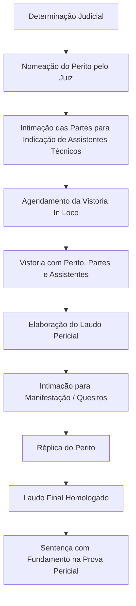

# Perícia Judicial de Engenharia em Navegantes SC: Como Funciona na Comarca e Como a Regê Engenharia Pode Ajudar

Você recebeu uma intimação para perícia judicial em Navegantes. Ou precisa ingressar com uma ação e o juiz determinou a produção de prova pericial. Nesse momento, entender como funciona a **perícia judicial de engenharia na Comarca de Navegantes** não é apenas burocracia — é a diferença entre ter uma prova técnica sólida ou perder o processo por falta de fundamentação.

Neste artigo, explicamos o passo a passo da perícia judicial na prática, os prazos do CPC, o papel do assistente técnico, e como a Regê Engenharia atua como sua parceira técnica para garantir que a verdade estrutural do seu imóvel seja comprovada com rigor.

## O que é Perícia Judicial de Engenharia

A **perícia judicial de engenharia** é um meio de prova técnico-científico determinado pelo juiz em processo judicial, realizado por um **perito oficial** (nomeado pelo juízo) para esclarecer questões técnicas que exigem conhecimento especializado em engenharia civil.

Diferente do laudo técnico particular (contratado por uma das partes), a perícia judicial tem **caráter oficial** e seu laudo tem **presunção de veracidade** — o juiz tende a aceitar suas conclusões, salvo prova em contrário robusta.

| Aspecto | Perícia Judicial | Laudo Particular (Extrajudicial) |
|---------|------------------|----------------------------------|
| **Quem solicita** | Juiz (de ofício ou a requerimento) | Parte interessada |
| **Quem realiza** | Perito oficial (lista do TJSC) | Engenheiro contratado pela parte |
| **Valor probatório** | Presunção de veracidade (art. 479 CPC) | Prova emprestada, sujeita a contestação |
| **Custeio** | Adiantado pela parte requerente | Pago integralmente pelo contratante |
| **Prazo** | Fixado pelo juiz (art. 465 CPC) | Combinado entre partes e engenheiro |
| **Participação** | Partes e assistentes técnicos comparecem | Apenas contratante e engenheiro |

> **Art. 464 do CPC** — "O juiz será assistido por perito quando a prova do fato depender de conhecimento técnico ou científico."

## Como Funciona a Perícia Judicial na Comarca de Navegantes

A Comarca de Navegantes (que abrange também Penha e região) possui varas cíveis que tramitam ações de responsabilidade civil, vícios construtivos, danos a imóveis vizinhos, embargos de obra e disputas condominiais. A dinâmica processual segue o CPC, mas com particularidades locais.

### Fluxo Prático na Comarca de Navegantes

### Etapas Detalhadas

#### 1. Determinação Judicial e Nomeação do Perito
- O juiz profere despacho determinando a perícia (geralmente após contestação)
- Nomeia perito da lista oficial do TJSC ou aceita indicação conjunta das partes
- Fixa prazo para entrega do laudo (comum: 30 a 60 dias)
- Determina o depósito dos honorários periciais pela parte requerente

#### 2. Indicação de Assistente Técnico (Sua Melhor Defesa)
- **Prazo:** 15 dias úteis após intimação (art. 465, § 1º CPC)
- Cada parte pode indicar **um assistente técnico** (engenheiro civil habilitado no CREA-SC)
- O assistente acompanha **todas as diligências**, formula **quesitos**, apresenta **parecer técnico** e critica o laudo do perito oficial
- **Sem assistente técnico, você fica refém do laudo do perito oficial sem contraponto**

#### 3. Vistoria In Loco (O Momento Decisivo)
- Agendada pelo perito com intimação de todas as partes
- Comparecem: perito oficial, assistentes técnicos, partes, advogados
- O perito inspeciona, fotografa, mede, coleta amostras se necessário
- **Assistente técnico registra tudo em paralelo** — fotos, medições, anotações
- É a **única chance** de apontar detalhes que o perito pode deixar passar

#### 4. Elaboração e Entrega do Laudo Pericial
O laudo deve conter (NBR 13752 + art. 474 CPC):
- Qualificação completa do perito e assistentes
- Descrição do objeto da perícia (quesitos do juiz + quesitos das partes)
- Metodologia utilizada (normas, ensaios, equipamentos)
- Análise técnica fundamentada
- Conclusões diretas aos quesitos
- ART registrada no CREA-SC

#### 5. Manifestação, Quesitos e Réplica
- Partes são intimadas para se manifestar sobre o laudo (prazo comum: 15 dias)
- Assistentes técnicos apresentam **pareceres técnicos** concordando ou divergindo
- Novos quesitos podem ser formulados (se autorizado pelo juiz)
- Perito apresenta **réplica** respondendo às críticas
- Juiz pode determinar complementação

## Por Que a Regê Engenharia é a Solução para sua Perícia Judicial em Navegantes

### 1. Conhecimento da Comarca e do Judiciário Local
Atuamos desde 2010 no litoral catarinense. Conhecemos:
- O ritmo processual das varas cíveis de Navegantes
- Os peritos oficiais mais frequentes na região
- As particularidades do TJSC em matéria de engenharia
- O perfil das decisões em ações de vícios construtivos e danos vizinhança

### 2. Atuação Completa como Assistente Técnico
Não nos limitamos a "assinar embaixo". Nossa atuação inclui:

| Etapa | Nossa Entrega |
|-------|---------------|
| **Pré-vistoria** | Estudo do processo, análise de documentos, preparação de quesitos estratégicos |
| **Vistoria In Loco** | Engenheiro sênior presente, registro fotográfico próprio, medições independentes, anotações técnicas em tempo real |
| **Análise do Laudo Oficial** | Leitura crítica ponto a ponto, identificação de omissões, erros metodológicos, conclusões não fundamentadas |
| **Parecer Técnico / Réplica** | Documento estruturado com fundamentação em NBRs, jurisprudência, fotos comparativas e planilhas de custos |
| **Acompanhamento até Sentença** | Manifestações complementares, resposta a réplica do perito, suporte ao advogado na sustentação oral |

### 3. Especialização em Casos do Litoral Catarinense
Nossos diferenciais técnicos para a realidade de Navegantes:

- **Solo arenoso e lençol freático alto**: Diagnóstico de recalques diferenciais, movimentação de fundações
- **Maresia e corrosão**: Avaliação de patologias por cloretos, carbonatação, corrosão de armaduras (NBR 6118)
- **Código Urbanístico LC 416/2023**: Verificação de conformidade de projetos aprovados vs. executados
- **Edificações de orla (Meia Praia, Gravatá)**: Experiência em prédios de alto padrão, sistemas de impermeabilização, fachadas ventiladas
- **Galpões industriais (Machados, São Domingos)**: Estruturas metálicas, pisos industriais, NR-12, NR-23

### 4. Casos de Sucesso na Comarca de Navegantes

| Tipo de Ação | Problema | Atuação Regê | Resultado |
|--------------|----------|--------------|-----------|
| **Vícios construtivos - Edifício Meia Praia** | Infiltrações em fachadas e varandas, trincas estruturais | Assistência técnica em perícia judicial; identificação de falhas na impermeabilização e cobrimento insuficiente de armaduras | Laudo pericial acolheu 80% dos quesitos; acordo favorável R$ 1,2M |
| **Dano a imóvel vizinho - Centro** | Trincas em residência causadas por escavação de edifício vizinho | Vistoria cautelar prévia + assistência em perícia; monitoramento de fissurômetros por 90 dias | Comprovação de nexo causal; condenação em reparação + danos morais |
| **Regularização de obra embargada - Gravatá** | Obra paralisada por divergência de projeto x executado | Perícia técnica para demonstrar conformidade estrutural; ART de regularização | Embargo levantado; alvará emitido em 45 dias |
| **Responsabilidade técnica - Galpão Machados** | Colapso parcial de cobertura metálica | Perícia de responsabilidade técnica; análise de projeto x execução x cálculo estrutural | Identificação de falha no dimensionamento de conexões; ação regressiva contra projetista |

## Prazos e Custos: O que Esperar

### Prazos Processuais (CPC + Prática Local)

| Etapa | Prazo Legal | Prática em Navegantes |
|-------|-------------|----------------------|
| Indicação de assistente técnico | 15 dias úteis (art. 465 § 1º) | Imediato após intimação |
| Vistoria in loco | Sem prazo fixo | 15 a 45 dias após nomeação |
| Entrega do laudo pericial | Fixado pelo juiz (art. 465) | 30 a 60 dias após vistoria |
| Manifestação sobre o laudo | 15 dias úteis | 15 dias úteis |
| Réplica do perito | 15 dias úteis | 15 a 30 dias |
| Sentença | Sem prazo fixo | 6 a 18 meses (depende da vara) |

### Investimento em Assistência Técnica

| Serviço | Valor Referência (2025/2026) |
|---------|-------------------------------|
| **Assistência técnica completa** (pré-vistoria + vistoria + parecer + réplica) | R$ 4.000 a R$ 12.000 |
| **Apenas parecer sobre laudo já entregue** | R$ 2.500 a R$ 5.000 |
| **Quesitos iniciais + acompanhamento de vistoria** | R$ 2.000 a R$ 4.000 |
| **Vistoria cautelar prévia (antes do processo)** | R$ 1.500 a R$ 3.500 |

> **Importante**: Os honorários do perito oficial são custeados pela parte requerente (podem ser ressarcidos em caso de vitória). A assistência técnica particular é custeada por cada parte — mas **o custo de não ter assistente pode ser a perda da causa**.

## Erros Fatais que Proprietários e Advogados Cometem

| Erro | Consequência | Como a Regê Evita |
|------|--------------|-------------------|
| **Não indicar assistente técnico no prazo** | Perda do direito de contestar o laudo oficialmente | Monitoramos prazos e protocolamos indicação no 1º dia |
| **Indicar assistente sem experiência em perícia** | Parecer fraco, sem fundamentação normativa, desconsiderado pelo juiz | Engenheiros com histórico de laudos aceitos no TJSC |
| **Não comparecer à vistoria** | Impossibilidade de apontar fatos in loco; prejuízo irreparável | Garantimos presença de engenheiro sênior em 100% das vistorias |
| **Aceitar laudo pericial sem análise crítica** | Perda de pontos decisivos (causa raiz, responsabilidade, quantum) | Análise linha a linha com base em NBRs e jurisprudência |
| **Não formular quesitos estratégicos** | Perito não responde ao que interessa ao seu caso | Elaboramos quesitos técnicos precisos, baseados no objeto da ação |

## Documentos Necessários para Iniciar

Para que possamos atuar como seu assistente técnico, precisamos de:

1. **Cópia da inicial e contestação** (entender o objeto da disputa)
2. **Despacho de nomeação do perito** (prazo, quesitos do juiz, perito nomeado)
3. **Projetos arquitetônico, estrutural, elétrico, hidráulico** (se houver)
4. **Contrato de compra/obra, memorial descritivo, termo de entrega**
5. **Comunicações com a construtora/parte contrária** (notificações, e-mails, WhatsApp)
6. **Fotos e vídeos do imóvel** (histórico da evolução dos danos)
7. **Laudos anteriores** (se já houver vistoria particular)
8. **Procuração para o advogado** (para acompanharmos os autos)

## Perguntas Frequentes

### "O juiz já nomeou o perito. Ainda dá tempo de contratar assistente técnico?"
**Sim**, se ainda estiver dentro do prazo de 15 dias úteis da intimação (art. 465 § 1º CPC). Fora do prazo, é possível requerer a reabertura, mas depende de deferimento judicial. **Não perca tempo.**

### "O perito oficial é da confiança do juiz. Vale a pena contestar?"
**Sim.** O perito oficial deve ser imparcial, mas erros técnicos acontecem: omissão de ensaios, conclusões sem fundamentação, aplicação errada de norma, desconsideração de documentos. Um assistente técnico qualificado identifica esses pontos e força a réplica — muitas vezes mudando o rumo do laudo.

### "Quanto custa uma perícia judicial completa?"
Os **honorários do perito oficial** variam de R$ 3.000 a R$ 15.000+ (conforme complexidade), pagos pela parte requerente. A **assistência técnica particular** (Regê Engenharia) varia de R$ 4.000 a R$ 12.000 para atuação completa. Em causas de alto valor, o investimento em assistência técnica é ínfimo frente ao risco.

### "Posso usar um laudo particular que já fiz como prova no processo?"
**Pode**, mas ele tem valor de **prova emprestada** — o juiz não é obrigado a aceitar. A perícia judicial tem presunção de veracidade. A estratégia ideal: **laudo particular bem feito → ingresso na Justiça → assistência técnica na perícia judicial**.

### "A Regê Engenharia faz a perícia judicial (como perito oficial)?"
**Não.** Como perito oficial, o engenheiro deve ser **imparcial** e é nomeado pelo juiz. A Regê Engenharia atua como **assistente técnico** das partes — defendendo tecnicamente o seu interesse com rigor, ética e fundamentação. É o papel que garante que **sua versão técnica seja ouvida**.

## Áreas de Atendimento para Perícia Judicial

Atendemos como assistente técnico em perícias judiciais nas seguintes comarcas e regiões:

- **Navegantes** (Comarca sede: Centro, Gravatá, São Domingos, Machados, Itinga, Meia Praia)
- **Penha** (Comarca de Navegantes)
- **Itajaí** (Comarca de Itajaí)
- **Balneário Camboriú** (Comarca de Balneário Camboriú)
- **Camboriú** (Comarca de Camboriú)
- **Gaspar** (Comarca de Gaspar)
- **Brusque** (Comarca de Brusque)
- **Tijucas** (Comarca de Tijucas)
- **Região da AMFRI** (Associação dos Municípios da Foz do Rio Itajaí)

## Fale com a Regê Engenharia

Se você tem uma perícia judicial em andamento em Navegantes ou região, **não deixe sua defesa técnica nas mãos do acaso**. A Regê Engenharia coloca à sua disposição:

- Engenheiros civis com CREA-SC ativo e especialização em perícias
- Experiência comprovada na Comarca de Navegantes e TJSC
- Metodologia baseada em NBR 13752, NBR 15575, NBR 6118
- Pareceres técnicos que resistem ao contraditório
- Compromisso com prazos processuais e qualidade probatória

📞 **Fale com nossa equipe técnica:** [https://bitlybr.net/rege](https://bitlybr.net/rege)  
📧 **E-mail:** contato@rege-engenharia.com.br  
📍 **Atendemos:** Navegantes, Penha, Itajaí, Balneário Camboriú, Camboriú, Gaspar e região do litoral norte de SC

---

## Próximos Passos

### 1. Análise Gratuita do Seu Caso
Envie o número do processo ou o despacho de nomeação do perito. Avaliamos a urgência, a complexidade e a viabilidade da atuação como assistente técnico.

### 2. Proposta de Atuação
Apresentamos escopo, cronograma, honorários e equipe designada. Tudo formalizado em contrato com ART.

### 3. Ativação Imediata
Protocolamos a indicação de assistente técnico, preparamos quesitos e iniciamos o estudo dos autos — **antes da vistoria**.

---

*Este artigo tem caráter informativo e não substitui consulta jurídica. A atuação em perícia judicial requer advogado constituído nos autos. A Regê Engenharia atua exclusivamente como assistente técnico de engenharia, em parceria com o patrono da causa.*

<!-- Updated: 2026-10-02 -->